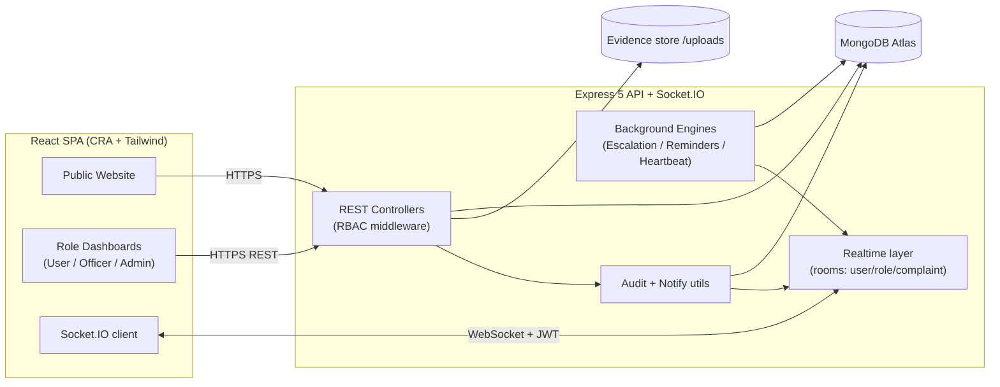

<div align="center">

# 🛡️ National Cyber Crime Reporting Portal

### A government-grade platform for reporting, investigating, and resolving cyber crimes — built for the FIA Cyber Crime Wing, Government of Pakistan (PECA 2016).

[](https://react.dev/)
[](https://expressjs.com/)
[](https://www.mongodb.com/atlas)
[](https://socket.io/)
[](https://tailwindcss.com/)

</div>

---

## 📖 Table of Contents

- [Project Overview](#-project-overview)
- [Problem Statement](#-problem-statement)
- [Solution Overview](#-solution-overview)
- [Complete Feature List](#-complete-feature-list)
  - [Public Website](#public-website-features)
  - [User Panel](#user-panel-features)
  - [Officer Panel](#officer-panel-features)
  - [Admin Panel](#admin-panel-features)
- [Complaint Lifecycle Workflow](#-complaint-lifecycle-workflow)
- [Escalation Engine](#-escalation-engine)
- [Real-Time Communication Architecture](#-real-time-communication-architecture)
- [Audit Trail System](#-audit-trail-system)
- [Evidence Management System](#-evidence-management-system)
- [Support Ticket System](#-support-ticket-system)
- [Analytics & Reporting](#-analytics--reporting)
- [System Health Monitoring](#-system-health-monitoring)
- [Authentication & RBAC](#-authentication--rbac)
- [Technology Stack](#-technology-stack)
- [System Architecture](#-system-architecture)
- [Database Overview](#-database-overview)
- [Folder Structure](#-folder-structure)
- [Installation Guide](#-installation-guide)
- [Environment Variables](#-environment-variables)
- [MongoDB Atlas Configuration](#-mongodb-atlas-configuration)
- [API Overview](#-api-overview)
- [Socket Events](#-socket-events)
- [Screenshots](#-screenshots)
- [Deployment Guide](#-deployment-guide)
- [Future Enhancements](#-future-enhancements)
- [Contributing](#-contributing)
- [License](#-license)
- [Author](#-author)

---

## 🎯 Project Overview

The **National Cyber Crime Reporting Portal** is a full-stack, enterprise-grade web application that lets citizens securely report cyber crimes, lets investigation officers manage cases end-to-end, and gives administrators full operational command over the platform.

It pairs a **premium public-facing website** (hero, services, awareness center, alerts, FAQs, contact, legal pages) with three **role-based dashboards** (User, Investigation Officer, Admin), a **real-time communication layer**, an **automated escalation engine**, a **persistent audit trail**, and **executive analytics** — all on a secure MongoDB Atlas backend.

The design language is consistent throughout: a government green / navy palette, glassmorphism, accessible components, smooth motion, dark mode, and mobile-first responsiveness.

---

## ❓ Problem Statement

Cyber crime reporting in many regions suffers from:

- **No single trusted channel** — victims don't know where or how to report digital crimes.
- **Opaque progress** — once a complaint is filed, citizens rarely know what's happening.
- **Manual triage & lost cases** — complaints sit unassigned or stall with no accountability.
- **Fragmented evidence & communication** — files and messages live in scattered places.
- **Weak oversight** — administrators lack live metrics, audit trails, and SLA enforcement.

---

## ✅ Solution Overview

This portal addresses each gap directly:

| Problem | Solution in this portal |
|---|---|
| No trusted channel | Public, branded portal with secure registration & guided reporting |
| Opaque progress | Order-tracking-style **complaint timeline** with officer + notes, real-time updates |
| Lost / stalled cases | **Automated escalation engine** with configurable SLAs and auto-reassignment |
| Fragmented evidence | **Evidence thread** — files + messages in one case record, with previews |
| Weak oversight | **Audit trail**, **advanced analytics**, **system health**, and **real-time** dashboards |

---

## 🧩 Complete Feature List

### Public Website Features
- Premium **hero**, services, **complaint workflow**, statistics with **animated counters**.
- **Cyber Awareness Center**, latest **cyber alerts**, **success stories / testimonials**.
- **FAQ** (accordion), **Contact**, **Help Center**, **Cyber Laws (PECA)**, **Security Guidelines**, **Blog**, **Emergency Help & Hotlines**.
- Legal: **Privacy Policy**, **Terms & Conditions**, **Cookie Policy**, **Data Privacy**.
- **Track Complaint** / **Status Checker** entry points.
- **Cookie consent** banner (Accept / Reject, persisted), **404** page, **scroll-to-top** + **back-to-top**, **reduced-motion** support, per-page **SEO meta** tags, full keyboard accessibility.

### User Panel Features
- **Report a Crime** with validation and inline error states.
- **Draft system** — autosave (debounced), **localStorage mirror** (survives refresh / accidental navigation), **auto-restore**, **multiple drafts**, and a dedicated **Drafts management page**.
- **Track Complaint** — real-time **progress timeline** (officer name + notes per stage), status & severity badges, escalation badge.
- **Evidence & Communication** — submit files **with a written message** in a single action; threaded view with sender, timestamp, preview/download.
- **Complaint Details** page, **notifications**, and **analytics** scoped to the user.

### Officer Panel Features
- **Investigation Workspace** — assignment queue, SLA countdowns, escalation badges.
- **Accept / Reject assignment** — rejection requires a reason and returns the case to the admin queue.
- **Status & severity updates** with notes that feed the user timeline.
- **Evidence thread** + **case messaging**.
- **Officer Calendar** — Evidence Review / User Meetings / Investigation Tasks / Case Deadlines / Follow-ups, with **priority levels**, month/week/agenda views, **due-reminder notifications**, and dashboard widgets (Today / Overdue / Upcoming).
- **Complaint Details**, notifications, and scoped analytics.

### Admin Panel Features
- **Command dashboard** — KPIs, recent complaints, **assign to officer**, status control, escalation badges.
- **User management** (approve/reject officers, roles, status), **Crime Map**, **Officer Performance**.
- **Advanced Analytics** (filters + CSV/Print export), **System Health** (live), **Escalations** + **Escalation Rules**, **Audit Trail**.
- **Global, role-aware search** across complaints, users, assignments, tickets, notifications.

---

## 🔄 Complaint Lifecycle Workflow

```
Submitted ──▶ Reviewed ──▶ Assigned ──▶ Investigation Started ──▶ Evidence Verified ──▶ Resolved / Closed
```

Backed by the canonical status enum: **Pending → In Review → Under Investigation → Resolved → Closed**.

1. **User** submits a complaint → severity & department are inferred → `Pending`.
2. **Admin** assigns it to a department-matched **Officer** → `Under Investigation` (recorded in status history with actor + note).
3. **Officer** **accepts** (begins work) or **rejects with a reason** (returns to admin queue, `Pending`).
4. Officer reviews **evidence**, exchanges **messages**, posts **notes**, and updates status.
5. Case is **Resolved/Closed** → resolution summary recorded; complainant notified.

Every transition is appended to an immutable **status history** (status, timestamp, actor, note) that powers the user-facing timeline.

---

## 🚨 Escalation Engine

A scalable, background engine that enforces SLAs without manual intervention.

- **Configurable SLAs** per severity (Critical / High / Medium / Low, in hours).
- **Triggers**: unassigned beyond SLA, no update beyond SLA, or inactive officer.
- **Auto-reassignment** to the most senior eligible officer (ranked by resolved-case volume, balanced by workload, department-matched).
- **Notifications** to admins (and the new officer), plus an immutable **EscalationLog** audit trail.
- **Warnings** before deadlines and **escalation badges** on dashboards.
- **Admin-configurable** via the Escalation Rules page; runs on an interval (default 15 min) and on demand.

---

## ⚡ Real-Time Communication Architecture

Powered by **Socket.IO** with a JWT-authenticated handshake and room-based delivery.

- **Rooms**: `user:<id>` (personal), `role:Admin|InvestigationOfficer|User` (broadcast), `complaint:<id>` (per-case detail view).
- **Centralized emits**: every in-app notification is delivered instantly via `createNotification`; every audit entry streams to admins via `recordAudit`; complaint/stat changes fan out from a single chokepoint.
- **Safe fallback**: polling remains as a backstop (longer intervals when connected), so the app degrades gracefully if WebSockets are blocked.
- **Coverage**: notifications, complaint status, assignment alerts, escalation alerts, support tickets, calendar reminders, dashboard statistics, and a system-health heartbeat.

> See [Socket Events](#-socket-events) for the full event catalog.

---

## 📜 Audit Trail System

A **persistent, append-only** audit collection (`auditLogs`) records critical actions:

`USER_REGISTERED`, `USER_LOGIN`, `USER_LOGOUT`, `USER_UPDATED`, `USER_DELETED`, `OFFICER_APPROVAL`, `COMPLAINT_CREATED`, `STATUS_CHANGED`, `COMPLAINT_UPDATED`, `COMPLAINT_ASSIGNED`, `ASSIGNMENT_ACCEPTED`, `ASSIGNMENT_REJECTED`, `COMPLAINT_DELETED`, `EVIDENCE_UPLOADED`, `ESCALATION`, `SUPPORT_TICKET_CREATED`, `SUPPORT_TICKET_UPDATED`.

Each entry captures **actor**, **role**, **entity**, **summary**, **metadata**, **IP**, and **timestamp**. Auditing is best-effort and never blocks the action it observes. The **Admin Audit Trail** page provides **search, action/entity/user filters, date ranges, pagination, CSV export**, and **live streaming** of new entries. Per-complaint audit history also appears on the Complaint Details page.

---

## 📎 Evidence Management System

- Upload **multiple files** (images, PDF, ZIP, TXT, CSV) with size/type/count validation (Multer).
- Attach a **written message** to each submission — building a real case **communication thread**.
- Each item shows **sender + role**, **timestamp**, the **message**, and **image preview / open / download**.
- Files are stored on disk and served from `/uploads`; metadata lives in the `evidence` collection and is referenced by the complaint.

---

## 🎫 Support Ticket System

- Citizens raise tickets (category, subject, message); status flows **Open → In Progress → Closed**.
- Admin replies and status changes notify the requester (in-app + real-time).
- Closed tickets accept a **rating + feedback**. A seeded **FAQ** powers the Help Center.

---

## 📊 Analytics & Reporting

- **Complaints by city, department, category, severity, status**; **monthly trends**; **resolution rate**; **average resolution time**; **officer workload & performance**; **escalated cases**; **notification activity**.
- **Interactive filters** (date range, city, category, officer, status, department) with drill-down.
- **Export-ready**: CSV/Excel and Print/PDF. Cached server-side for read-heavy dashboards.
- **Crime Map** and **Officer Performance** views complement the Advanced Analytics dashboard.

---

## 🩺 System Health Monitoring

A live operational dashboard showing **API status (with latency), database status, uptime, active sessions, online officers (estimated), complaint queue size, evidence storage, throughput, user breakdown, officer utilization, notifications**, plus a **Recent System Activity** feed. It **auto-refreshes** via the real-time heartbeat with a slow polling fallback.

---

## 🔐 Authentication & RBAC

- **JWT** access tokens (stored client-side) **plus server-side sessions** with an httpOnly cookie; sessions can be revoked (logout invalidates immediately).
- **bcrypt** password hashing; officer signup gated by an **enrollment token** and **admin approval**.
- **Optional WhatsApp OTP** phone verification during registration (provider-abstracted: console stub today, WhatsApp Cloud API by env only) with a **resend countdown timer**, attempt/expiry limits.
- **Roles**: `Admin`, `InvestigationOfficer` (must be approved), `PendingOfficer`, `User`.
- Enforced on the **backend** (route middleware) and reflected on the **frontend** (route guards + role-filtered navigation).

---

## 🛠 Technology Stack

**Frontend**
- React 19, React Router 6, Tailwind CSS 3, Framer Motion
- ApexCharts, custom SVG charts, React Icons
- Socket.IO client, `useSyncExternalStore` shared stores

**Backend**
- Node.js, Express 5, Mongoose 9, MongoDB Atlas
- Socket.IO, JSON Web Tokens, bcrypt, Multer
- Helmet, CORS, compression, express-rate-limit, cookie-parser

**Tooling**
- Create React App (react-scripts), Prettier, Nodemon, Autocannon (load testing)

---

## 🏗 System Architecture



---

## 🗄 Database Overview

MongoDB (Mongoose) collections:

| Collection | Purpose |
|---|---|
| `users` | Accounts, roles, officer approval, phone verification |
| `complaints` | Cyber crime cases, status/severity, status history, case notes, escalation state |
| `assignments` | Officer ↔ complaint assignments + accept/reject response |
| `evidence` | Uploaded files + attached messages (thread) |
| `complaintMessages` | Case Q&A messages |
| `notifications` | In-app / email / SMS notifications |
| `sessions` | JWT session tracking & revocation |
| `reminders` | Officer calendar events (category, priority, due, completion) |
| `supportTickets` | Help desk tickets + feedback |
| `auditLogs` | Persistent audit trail |
| `escalationConfigs` / `escalationLogs` | SLA config + immutable escalation history |
| `officerApprovalLogs` | Officer approval decisions |
| `complaintDrafts` | Server-side complaint drafts |
| `faqs` | Help Center FAQ |

---

## 📁 Folder Structure

```
horizon-tailwind-react-main/
├── public/                      # CRA static assets
├── src/                         # React frontend
│   ├── components/
│   │   ├── public/              # Public site (Navbar, Footer, sections, CookieConsent, ...)
│   │   ├── navbar/              # Dashboard navbar + GlobalSearch
│   │   ├── sidebar/             # Role-filtered sidebar
│   │   ├── ui/                  # Shared kit (StatCard, badges, skeletons, EvidenceThread, charts, timelines)
│   │   └── ...
│   ├── layouts/                 # public / auth / admin / rtl layouts
│   ├── routes/publicRoutes.js   # Public routes
│   ├── routes.js                # Authenticated (RBAC) routes
│   ├── services/                # api.js (fetch wrapper), socket.js (realtime client)
│   ├── utils/                   # auth, notificationsStore, remindersStore, exporters, cookieConsent
│   ├── views/
│   │   ├── public/              # Home, About, Services, FAQ, NotFound, ...
│   │   ├── auth/                # SignIn, Register
│   │   └── admin/               # Dashboards & pages (CrimeDashboard, Investigations, Evidence,
│   │                            #   ComplaintDetails, Drafts, AuditLog, SystemHealth, Analytics, ...)
│   └── index.js / App.jsx
├── backend/                     # Express API
│   ├── config/                  # appConfig.js
│   ├── controllers/             # user, complaint, evidence, message, assignment, escalation,
│   │                            #   report, audit, search, support, reminder, draft, otp, notification
│   ├── middleware/              # auth, roles, security, upload, errorHandler
│   ├── models/                  # Mongoose schemas
│   ├── routes/                  # Express routers (mounted under /api)
│   ├── utils/                   # realtime, notify, audit, escalationEngine, reminderEngine, otpProvider, ...
│   ├── uploads/                 # Stored evidence files
│   └── server.js                # App + Socket.IO bootstrap
├── tailwind.config.js
└── README.md
```

---

## 🚀 Installation Guide

### Prerequisites
- **Node.js** ≥ 18 and npm
- A **MongoDB Atlas** cluster (or local MongoDB)

### 1. Clone
```bash
git clone <your-repo-url>
cd horizon-tailwind-react-main
```

### 2. Backend setup
```bash
cd backend
npm install
cp .env.example .env        # then edit .env (see below)
npm run dev                 # nodemon, or: npm start
# API on http://localhost:5000  (Socket.IO shares this port)
```

### 3. Frontend setup
```bash
# from the project root (new terminal)
npm install
npm start
# App on http://localhost:3000
```

The default admin is seeded on first boot from `DEFAULT_ADMIN_EMAIL` / `DEFAULT_ADMIN_PASSWORD`.

---

## 🔧 Environment Variables

Create `backend/.env`:

```bash
# Server
PORT=5000
NODE_ENV=development

# Database (MongoDB Atlas)
MONGO_URI=mongodb+srv://<user>:<pass>@<cluster>.mongodb.net/CyberCrimeDB?retryWrites=true&w=majority&appName=<app>

# Auth
JWT_SECRET=replace-with-a-strong-secret
JWT_EXPIRES_IN=7d

# Officer enrollment (required for officer signup if set)
OFFICER_ENROLLMENT_TOKEN=your-enrollment-token

# CORS (frontend origin) — also used for the Socket.IO handshake
CORS_ORIGIN=http://localhost:3000

# Seeded admin (created on first boot)
DEFAULT_ADMIN_EMAIL=admin@cybercrime.local
DEFAULT_ADMIN_PASSWORD=Admin@12345

# Background engines (optional)
ESCALATION_INTERVAL_MIN=15
REMINDER_INTERVAL_MIN=5

# OTP provider (optional; defaults to console stub)
OTP_PROVIDER=console            # or: whatsapp_cloud
WHATSAPP_TOKEN=
WHATSAPP_PHONE_ID=

# Sessions / cookies (production)
SESSION_COOKIE_NAME=ccrs_session
SESSION_COOKIE_SECURE=false     # true behind HTTPS
SESSION_COOKIE_SAMESITE=lax
```

> The frontend reads `REACT_APP_API_URL` (defaults to `http://localhost:5000/api`); the Socket.IO origin is derived from it automatically.

---

## ☁️ MongoDB Atlas Configuration

1. Create a free cluster at [mongodb.com/atlas](https://www.mongodb.com/atlas).
2. **Database Access** → add a database user (username + password).
3. **Network Access** → allow your IP (or `0.0.0.0/0` for testing only).
4. **Connect → Drivers** → copy the connection string into `MONGO_URI` (keep the `CyberCrimeDB` database name).
5. Start the backend — indexes are synced and the admin + FAQ are seeded automatically.

---

## 🌐 API Overview

All endpoints are mounted under `/api`. Protected routes require `Authorization: Bearer <token>` (or the session cookie) and are role-guarded.

| Area | Key endpoints |
|---|---|
| **Auth / Users** | `POST /users/register`, `POST /users/login`, `POST /users/logout`, `GET /users/me`, `GET /users`, officer review & user management |
| **OTP** | `POST /otp/request`, `POST /otp/resend`, `POST /otp/verify` |
| **Complaints** | `POST /complaints`, `GET /complaints/search`, `GET /complaints/stats`, `GET /complaints/assigned`, `POST /:id/assign`, `POST /:id/respond`, `PATCH /:id/status`, `GET /:id/details`, `DELETE /:id` |
| **Evidence / Messages** | `POST/GET /complaints/:id/evidence`, `POST/GET /complaints/:id/messages` |
| **Assignments** | `GET /assignments/my`, `GET/POST/PATCH/DELETE /assignments` |
| **Drafts** | `GET/POST /drafts`, `GET/DELETE /drafts/:id` |
| **Notifications** | `GET /notifications`, `PATCH /:id/read`, `PATCH /read-all` |
| **Reminders** | `GET/POST /reminders`, `PATCH/DELETE /reminders/:id` |
| **Support Tickets** | `POST/GET /support-tickets`, `PATCH /:id`, `PATCH /:id/feedback`, `GET /faq/list` |
| **Reports / Analytics** | `GET /reports/summary`, `/analytics`, `/officer-performance`, `/system-health`, `/escalations`, `/audit-log` |
| **Escalations** | `GET/PUT /escalations/config`, `GET /queue`, `GET /logs`, `GET /stats`, `POST /run`, `POST /:id/reassign` |
| **Audit Trail** | `GET /audit-logs` (search/filter/date/user/pagination) |
| **Global Search** | `GET /search?q=` (role-scoped) |
| **Health** | `GET /health` |

---

## 📡 Socket Events

**Client → Server**

| Event | Purpose |
|---|---|
| `complaint:subscribe` / `complaint:unsubscribe` | Join/leave a complaint room (Details page) |

**Server → Client**

| Event | Room | Payload |
|---|---|---|
| `connected` | socket | `{ userId, role, at }` |
| `notification:new` | `user:<id>` | `{ notification }` |
| `complaint:updated` | admin / owner / officer / `complaint:<id>` | `{ complaintId }` |
| `stats:changed` | admin / affected users | `{}` (triggers dashboard refresh) |
| `escalation:alert` | `role:Admin` | `{ complaintId, referenceId, level, severity, reason }` |
| `ticket:updated` | `role:Admin` | `{ ticketId, status }` |
| `audit:new` | `role:Admin` | `{ log }` |
| `health:tick` | `role:Admin` | `{ at }` |

All listeners degrade gracefully to polling if the socket is unavailable.

---

## 📸 Screenshots

> Replace these placeholders with real screenshots in `docs/screenshots/`.

| Public Home | User Timeline | Officer Workspace |
|---|---|---|
| _`docs/screenshots/home.png`_ | _`docs/screenshots/timeline.png`_ | _`docs/screenshots/officer.png`_ |

| Admin Dashboard | Advanced Analytics | Audit Trail |
|---|---|---|
| _`docs/screenshots/admin.png`_ | _`docs/screenshots/analytics.png`_ | _`docs/screenshots/audit.png`_ |

| Complaint Details | System Health | Escalation Rules |
|---|---|---|
| _`docs/screenshots/details.png`_ | _`docs/screenshots/health.png`_ | _`docs/screenshots/escalation.png`_ |

---

## 🚢 Deployment Guide

**Frontend (static)**
```bash
npm run build       # outputs ./build
# Deploy to Vercel / Netlify / Nginx; set REACT_APP_API_URL to the API origin
```

**Backend (Node + WebSockets)**
- Deploy to a host that supports **persistent WebSocket connections** (Render, Railway, Fly.io, a VM, etc.).
- Set all production env vars; `NODE_ENV=production`, `SESSION_COOKIE_SECURE=true`, real `CORS_ORIGIN`.
- Behind a load balancer / multiple instances, enable **sticky sessions** or add the **Socket.IO Redis adapter** so real-time events broadcast across nodes.
- Put the API behind **HTTPS** (reverse proxy) and ensure WebSocket upgrade headers pass through.
- Consider object storage (S3/GCS) for evidence instead of local `/uploads` at scale, and a TTL/retention policy for `auditLogs`.

---

## 🔮 Future Enhancements

- Socket.IO **Redis adapter** for horizontal scaling.
- **Email/SMS** notification channels (currently modeled; delivery stubbed).
- **2FA** for admins/officers and full WhatsApp OTP rollout.
- **Cloud object storage** + virus scanning for evidence.
- **PDF report generation** server-side (Puppeteer) and scheduled report emails.
- **i18n / Urdu localization** and an offline-friendly PWA mode.
- Automated **test suite** (unit + integration + e2e).

---

## 🤝 Contributing

1. Fork the repo and create a feature branch: `git checkout -b feature/your-feature`.
2. Follow the existing code style (Prettier; match surrounding conventions).
3. Keep changes additive — **do not break existing APIs, workflows, or RBAC**.
4. Run `npm run build` (frontend) and verify the backend loads before opening a PR.
5. Submit a clear PR describing **what** changed and **why**.

---

## 📄 License

This project is distributed under the terms in [LICENSE.md](LICENSE.md). It is intended for educational, governmental, and authorized public-service use.

---

## 👤 Author

**alishasajjad** 

> Update this section with your name, organization, and contact details before publishing. Built as a final-year / enterprise capstone implementation of a national cyber crime management platform.

---

<div align="center">

**Built for a safer digital Pakistan 🇵🇰 — report cyber crime with confidence.**

</div>
